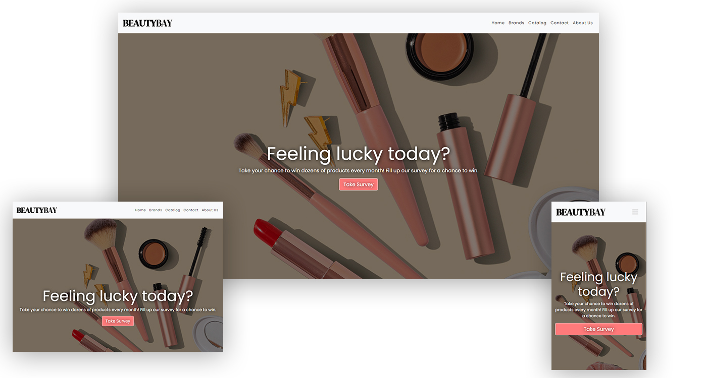
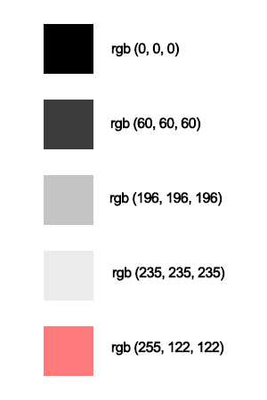
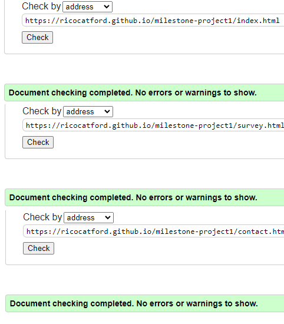
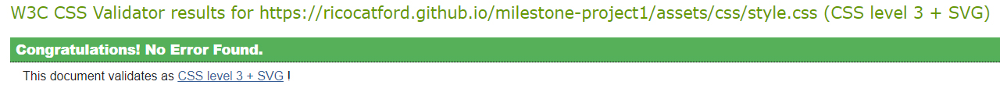
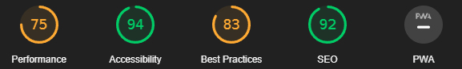
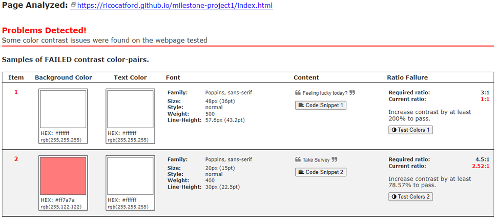

# BeautyBay



## Description

BeautyBay is an online shop website for makeup, cosmetic and beauty products. Featuring a wide range of products for your skin, hair and body with a very intuitive and carefully planned User Interface. I built this website based on several popular online shops of this field with things I would improve on those sites such as:

- Responsive design for all devices.
- Less clustered, products are more spaced out.
- Made it more colourful and vivid.

## Live Project

You can find it hosted [here](https://ricocatford.github.io/beautybay).

## User stories

### First time users

Users who are visiting the website for first time. As a first time user they would like to see:

- Delivery and contact information.
- Brands selection available.
- Friendly and intuitive accessibility and navigation.

### Returning users

Users who are visiting the website multiple times and/or are regular customers. As a returning use they would like to see:

- Featured products.
- Giveaways and contests.
- Ease for contacting customer service as well as times and dates.

### Business owners

These are the owners of the business. As a business owner I would like my website to have:

- Fully responsive design across all devices screen sizes.
- Colourful and intuitive navigation with enough space to avoid overwhelming users with products.

## Design

### Colors



### Typography

The entire website is using same typography 'Poppins'. The only exception is brand logo where I used 'DM Serif'.

### Imagery

Multiple images of the products and brands were taken from [Feelunique](https://feelunique.com) and edited with Adobe Photoshop. Hero section background image is from [Unsplash](https://unsplash.com).

### Video

Video used is from [Artgrid](https://artgrid.io).

### Icons

All icons used are from [FontAwesome](https://fontawesome.com).

## Site Structure

Website consists of three pages:

- Home
- Survey
- Contact

All pages have same navigation bar and footer. Home page contains several different sections that are well spaced out for giving some breath to the design.

## Features

### Current features

I wanted to improve designs that inspired me from other online shops and were lacking all or some of the following features:

- Fully responsive design.
- Well organized catalog and easy to view.
- Interactive elements such as videos, images, buttons.

### Future features

I intend to extend the code as soon as I've the knowledge to implement:

- Login system.
- Shopping cart.
- Filter products by brands.

## Testing

Carried out numerous tests in the following browsers with no errors found:

- Google Chrome
- Microsoft Edge
- Mozilla Firefox
- Safari

### HTML Validator

Tested HTML code with [W3C Markup Validation Service](https://validator.w3.org/) with no errors or warnings found:



### CSS Validator

Tested CSS code with [W3C CSS Validation Service](https://jigsaw.w3.org/css-validator/) with no errors or warnings found:



### Lighthouse

Tested entire website with popular developers extension [Lighthouse](https://chrome.google.com/webstore/detail/lighthouse/blipmdconlkpinefehnmjammfjpmpbjk/) and these are the results:



### A11y Color Contrast

Tested entire website with [A11y Color Contrast](https://color.a11y.com) and found some problems (unsolved) in hero section:



## Technologies used: Languages, frameworks, libraries and programs

The entire website was built with:

- HTML5
- CSS3
- Bootstrap 4
- jQuery (already included in Bootstrap)
- FontAwesome

As well used Adobe Photoshop for editing images.

## Deployment

Used GitPod for local environment and edition, hosted on GitHub Pages. The steps I followed for deployment are:

- Clone [repository](https://github.com/ricocatford/milestone-project1)
- Open cloned repository
- Go to your GitHub account and go to repository
- Above repository files you find a navbar with different buttons, go to 'Settings'
- Click on 'Pages', you can find it on side navbar inside settings
- Select 'main' branch and click 'Save' button
- On top of the section it will show you a link to the current URL where your repository has been hosted

## Credits & Acknowledgments

- GitPod
- GitHub
- Bootstrap
- Font Awesome
- Google Fonts
- Artgrid
- Feelunique eShop

I would also like to mention learning platform [Scrimba](https://scrimba.com) which helped me a lot with extending my knowledge in CSS and HTML. Also YouTube channel [TheCoderCoder](https://www.youtube.com/c/TheCoderCoder) that helped me with this little -magic- piece of code for setting opacity to background image in the hero section:

```md
.hero-container::before {
    content: "";
    position: absolute;
    top: 0;
    right: 0;
    bottom: 0;
    left: 0;
    background-color: rgba(0, 0, 0, 0.5);
}
```

## License

There's no license for this code. If you want to use it for commercial purposes please, [contact](mailto:rico.albarenque@gmail.com) me before doing so. Thanks.
