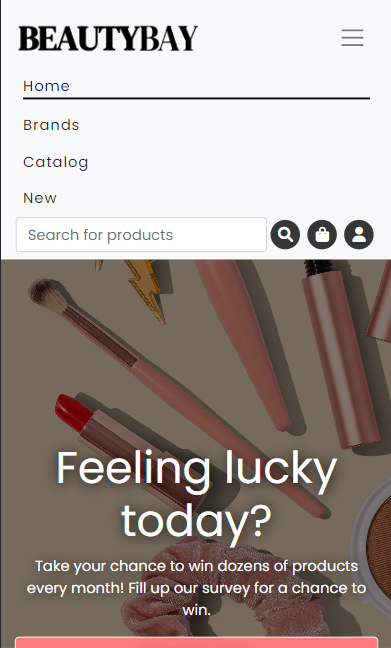
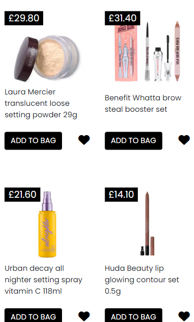
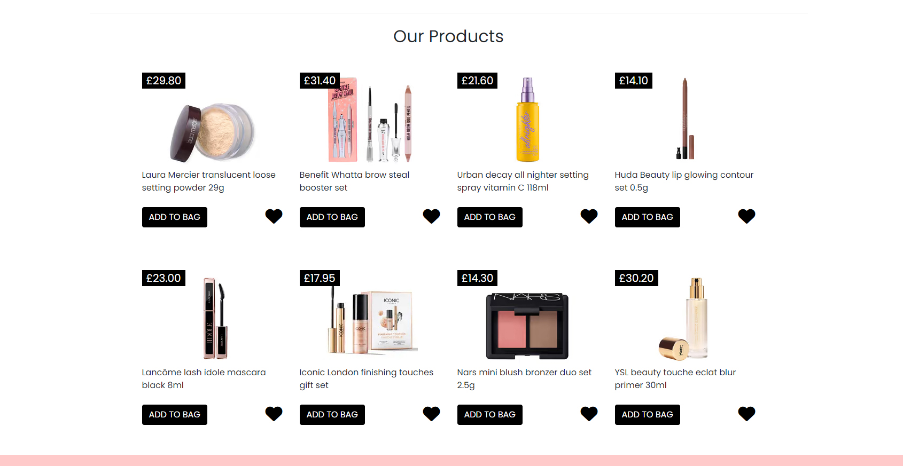
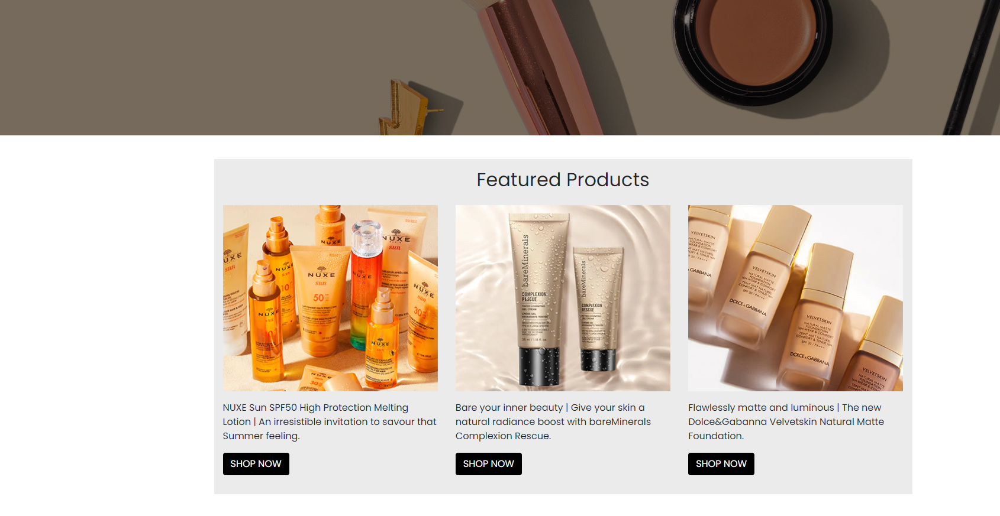

# BeautyBay


## Description

BeautyBay is an online shop website for makeup, cosmetic and beauty products. Featuring a wide range of products for your skin, hair and body with a very intuitive and carefully planned User Interface. I built this website based on several popular online shops of this field with things I would improve on those sites such as:

- Complete responsive design for all devices.
- Less clustered, products are more spaced out.
- Made it more colourful and vivid.

## Languages, Frameworks and Libraries

The entire website was built with:

- HTML5
- CSS3
- Bootstrap 4
- Font Awesome

## Installation and Deployment

I recommend using GitPod for setting your local environment without problems. Steps are the following:

- Clone [repository](https://github.com/ricocatford/milestone-project1)
- Open cloned repository with [GitPod](https://gitpod.io)
- Type this command in your terminal:

```md
python3 -m http.server
```

## Credits & Acknowledgments

- GitPod
- GitHub
- Bootstrap
- Font Awesome (icons)
- Google Fonts (font)
- Artgrid (video)
- Feelunique eShop (some images)

I would also like to mention learning platform [Scrimba](https://scrimba.com). Also YouTube channel [TheCoderCoder](https://www.youtube.com/c/TheCoderCoder) that helped me with this little -magic- piece of code for setting opacity to background image in the hero section:

```md
.hero-container::before {
    content: "";
    position: absolute;
    top: 0;
    right: 0;
    bottom: 0;
    left: 0;
    background-color: rgba(0, 0, 0, 0.5);
}
```

## User stories

### Lisa Bonham

    As a person that only browses the web on mobile phone, I wanted an online shop that is easy to navigate on my mobile phone device.




### Ariel Stevenson

    As a pretty distracted person, I wanted an online shop that is not flooded by many products and price tags, and there's also space between different sections.




## License

There's no license for this code. If you are gonna use it for commercial purposes please, [contact](mailto:rico.albarenque@gmail.com) me before doing so. Thanks.